

 We're Safe 

Functional Specifications

 

 Clémentine Curel
  

 

 ALGOSUP,  We're safe. All Rights Reserved. 

 

Table of content

- [Context](#context)
- [Goal](#goal)
- [Stakeholders](#stakeholders)
- [Target](#target)
- [Personas](#personas)
- [Scenarios](#scenarios)
  - [Aly's scenario](#alys-scenario)
  - [Anna's scenario](#annas-scenario)
  - [Brianna's scenario](#briannas-scenario)
  - [Colby's scenario](#colbys-scenario)
  - [Courtney's scenario](#courtneys-scenario)
  - [Katy's scenario](#katys-scenario)
  - [Kayla's scenario](#kaylas-scenario)
  - [Zaynab's scenario](#zaynabs-scenario)
- [Functional requirements](#functional-requirements)
  - [Creation of an account](#creation-of-an-account)
    - [User registration](#user-registration)
    - [Account setup](#account-setup)
    - [Personalized settings](#personalized-settings)
    - [Emergency contacts](#emergency-contacts)
    - [Privacy and security](#privacy-and-security)
    - [User support](#user-support)
  - [Emergency button](#emergency-button)
    - [Quick access](#quick-access)
    - [One-touch activation](#one-touch-activation)
    - [Emergency contact](#emergency-contact)
    - [Location tracking](#location-tracking)
    - [Audio or video recording](#audio-or-video-recording)
    - [Alerts and notifications:](#alerts-and-notifications)
    - [Emergency numbers](#emergency-numbers)
    - [Vocal assistance](#vocal-assistance)
  - [Map](#map)
    - [Heat map](#heat-map)
    - [Map Filters](#map-filters)
    - [Safe itinerary](#safe-itinerary)
  - [Reporting](#reporting)
  - [Notification](#notification)
    - [Receive notification](#receive-notification)
    - [Send notification](#send-notification)
  - [Detection of spy application](#detection-of-spy-application)
  - [Database of evidence](#database-of-evidence)
  - [Out of service](#out-of-service)
  - [Cross-platform](#cross-platform)
  - [Law information](#law-information)
- [Acceptance criteria](#acceptance-criteria)
- [Design](#design)
- [Non-functional requirements](#non-functional-requirements)
- [Out of scope](#out-of-scope)
- [Constraints and assumptions](#constraints-and-assumptions)
  - [Constraints](#constraints)
  - [Assumptions](#assumptions)
- [Security](#security)
- [Footnotes](#footnotes)

 

# Context

This project aims to create a software application that empowers women to take control of their safety and quickly access help if they feel threatened or unsafe. 

The problem addressed is that many women face the risk of violence or harassment in public spaces or their homes. Existing solutions have limitations, such as high costs, lack of accessibility or limited reach, and do not always provide reliable and rapid assistance.

# Goal

The goal of this project is to provide a user-friendly, affordable, fast, and widely accessible software application that enables women to feel more secure and confident in their daily lives. 

The software application will leverage the latest advances in technology, including mobile devices, location-based services, and cloud computing, to deliver a reliable and effective solution that meets the needs of the users.

# Stakeholders

The stakeholders of this project could include:

- Women who will use the application to protect themselves and seek help.

- Sponsors who will provide funding and resources for the project to be developed and sustained over time.

- Law enforcement agencies and emergency services that may be involved in providing support to women in distress through the application.

- Women's rights organizations and advocacy groups that may be interested in promoting the use of the application and ensuring that it aligns with their goals and values.

- Regulatory bodies or government agencies that may have a role in overseeing the development and use of the application to ensure that it complies with laws and regulations.

- Friends and family members of women who may use the application, as they may be involved in providing support and assistance in cases of emergency.

- Media outlets or journalists who may report on the application and its impact on society.

- As this project is part of my studies, ALGOSUP [^algosup] will have a role in checking the work done.

# Target

The target audience for this project is women of all ages, backgrounds, and locations who want to feel more secure and protected in their daily lives. The software application will be designed to be easy to use, intuitive, and customizable to fit the preferences and needs of each user. The application will also take into account the specific risks and challenges faced by women in different contexts and provide relevant guidance and support.

# Personas

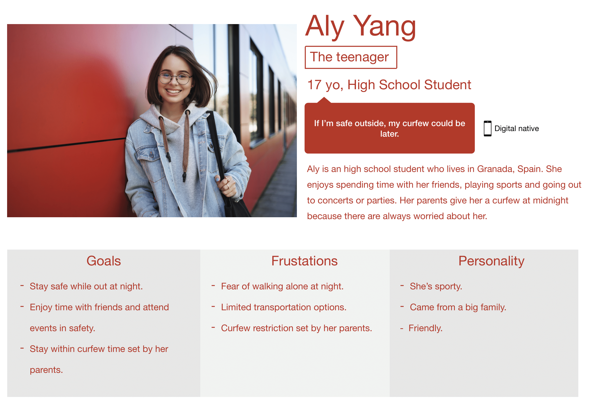

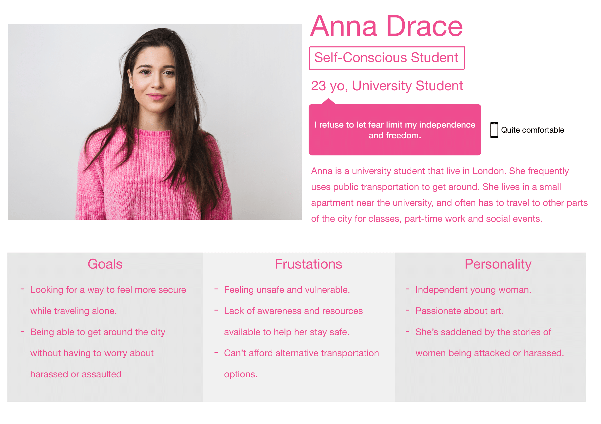

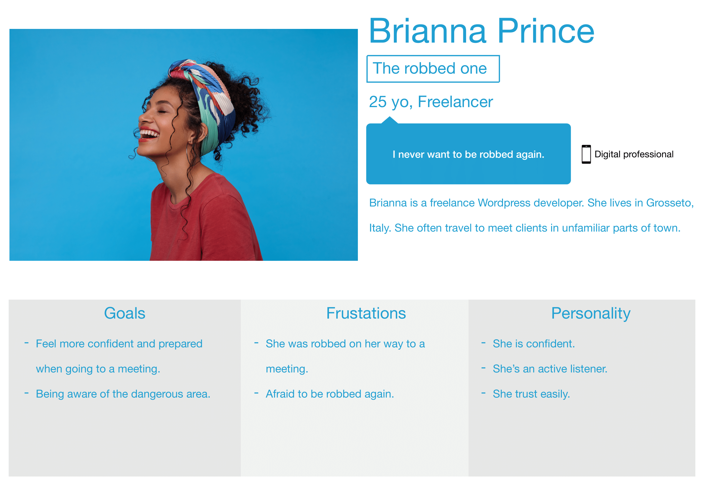

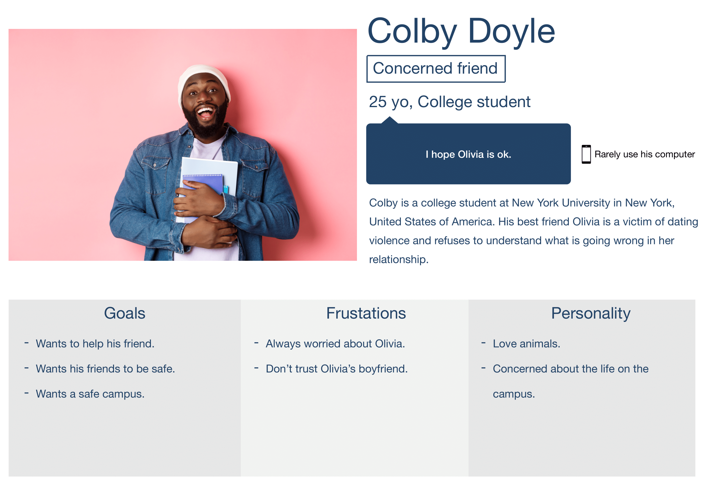

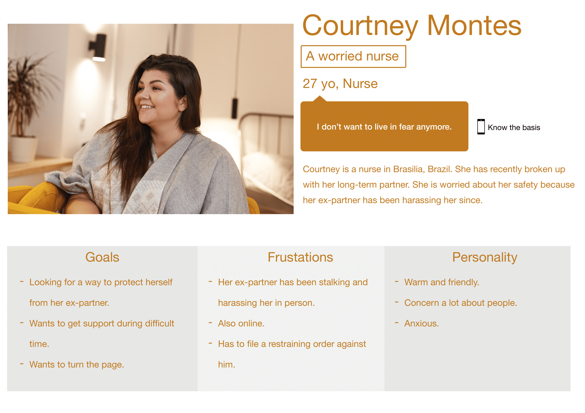

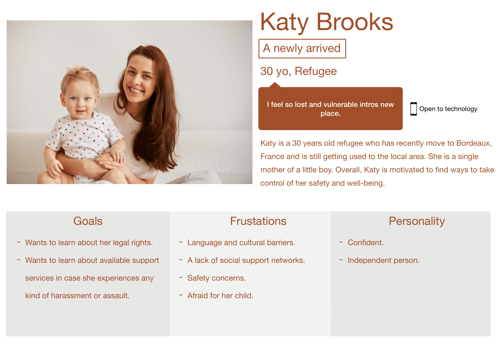

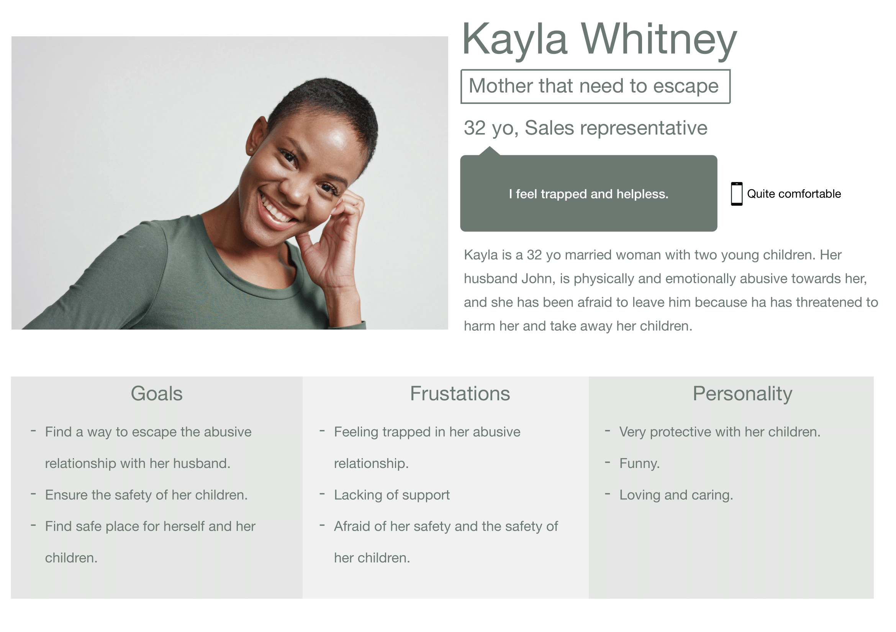

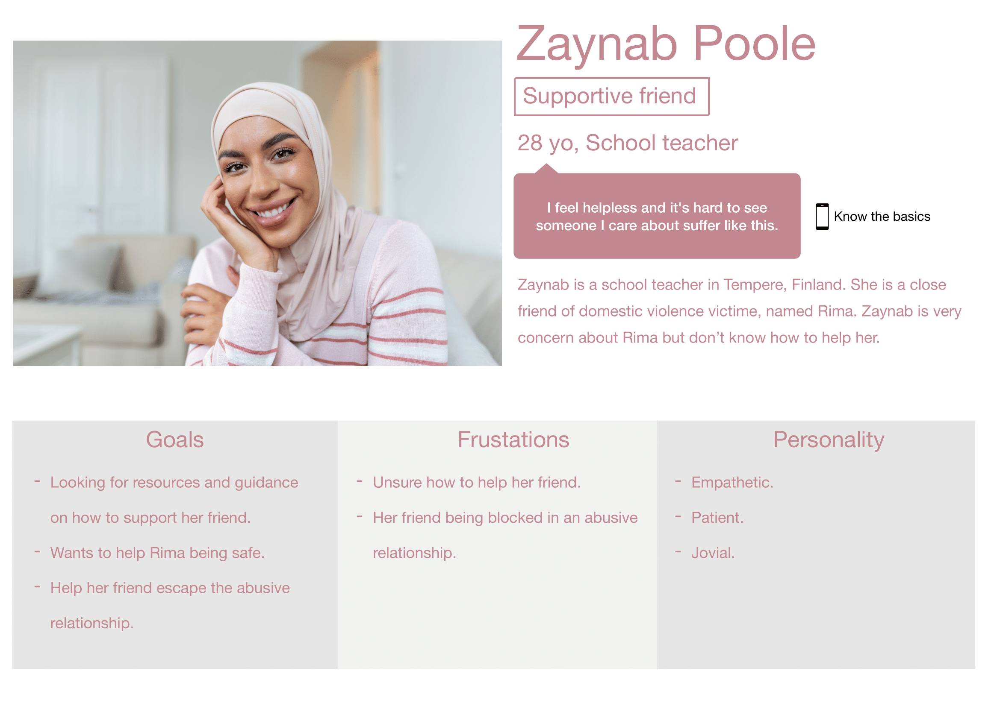

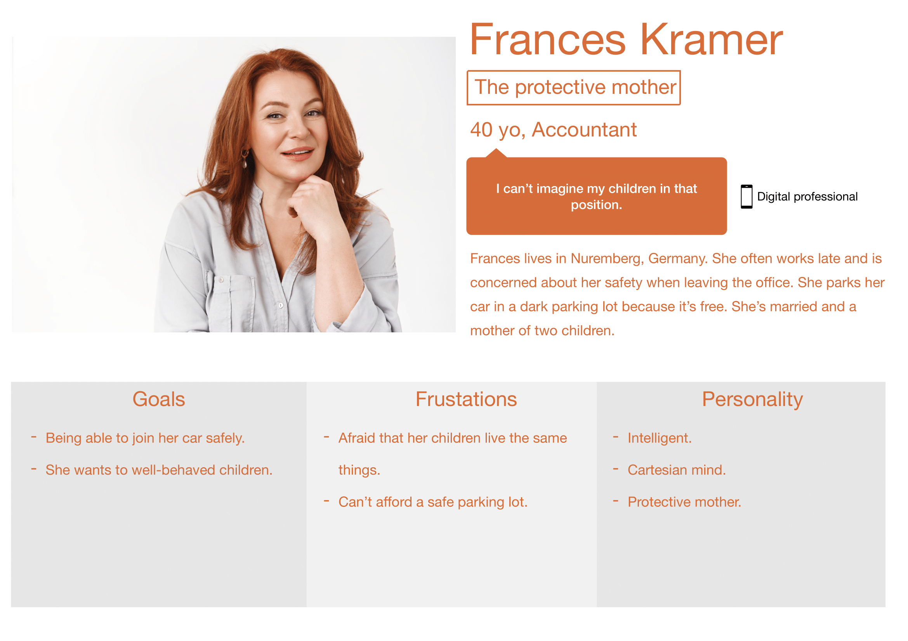

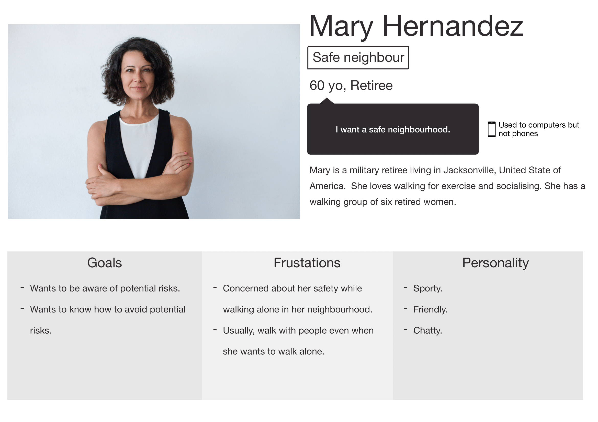

All the pictures used for the personas came from freepik.com.

# Scenarios

## Aly's scenario

Aly is an outgoing high school student who enjoys socializing and attending events with her friends. However, her parents are always worried about her safety, so they have imposed a strict curfew at midnight. Aly understands their concern but sometimes feels frustrated and limited by their rules.

One day, Aly's friend recommends that she download the We're Safe app to help ease her parents' worries and allow her to stay out a little later. Aly is hesitant at first but decides to give it a try.

With We're Safe, Aly can use the "Safe Places" feature to find well-lit and secure areas where she can hang out with her friends. She is also able to set a "Companion" timer, which notifies her designated contacts if she doesn't check in after a certain amount of time.
Aly's parents are initially sceptical of the app, but they become more comfortable with her going out when she shows them the features and how it can help keep her safe. They are particularly reassured by the "Companion" timer, which provides an extra level of security and peace of mind for them.

Over time, Aly becomes more comfortable using We're Safe and begins to explore her city more confidently, knowing that she has a reliable tool to help her stay safe. She's grateful for her friend's recommendation and the increased trust and independence that the app has provided.

## Anna's scenario

Anna uses We're Safe on her phone to check the route for her daily commute to the university. She's happy to see that the app has a map that indicates the streets that are well-lit and safe places to walk. As she reviews the route, she notices that one part of her commute is not well-lit, and the app shows that there are no safe places nearby.

Anna is concerned about this and decides to report the issue through the app. She quickly finds the "Report an Issue" feature and describes the problem. She also includes a photo of the poorly lit area so that the We're Safe team can investigate further.

The next day, Anna receives a notification from We're Safe indicating that they have investigated the area and have added additional lighting. Anna is relieved to hear this news and feels much safer on her daily commute. She also appreciates the quick response from We're Safe and decides to use the app to report any safety issues in her neighbourhood from now on.

## Brianna's scenario

Brianna is a freelance WordPress developer who frequently travels to meet clients in unfamiliar parts of town. She always carries her phone with her to stay connected with her clients and colleagues. However, Brianna often feels uneasy and unsafe while travelling alone, especially in new or unfamiliar areas.

One day, while walking to a meeting with a new client in an unfamiliar part of Grosseto, Brianna decides to try We're Safe. She opens the app and inputs her destination, and We're Safe generates a route for her, highlighting the safest streets and areas to avoid. The app also provides her with real-time updates on any safety concerns or incidents in the area.

As Brianna walks, she feels more secure and confident, knowing that she's using a tool that can help her stay safe. She notices that the app alerts her to an upcoming area that has a history of theft and vandalism, and she quickly decides to take a detour to avoid that area.

Thanks to We're Safe, Brianna arrives safely at her meeting with her new client, feeling more secure and empowered. She decides to continue using the app to help her navigate unfamiliar areas and even recommends it to her other freelancer friends who travel frequently for work.

## Colby's scenario

Colby is worried about his friend Olivia who is in an abusive relationship. He downloads the "We're Safe" application and sets up a personal profile. He also sets up his friend's emergency contacts, which include her family and the campus police department. 

Colby encourages his friend to download the app as well, but she is hesitant. Colby explains to her how the app works, and how it can help her feel safer and more secure in her daily life. With her permission, Colby sets up a "safety buddy" feature with her on the app, which allows him to receive alerts whenever she feels unsafe or needs help. 

Colby can then take appropriate action to ensure his friend's safety, whether that means checking in on her or calling for emergency assistance. With the "We're Safe" app, Colby feels more confident in his ability to help his friend and keep her safe from harm.

## Courtney's scenario

Courtney is a nurse who has been dealing with the stress of a recent break-up and the ongoing harassment from her ex-partner. She has been feeling anxious and scared for her safety, especially when travelling to and from work. She is looking for a solution that can help her feel more secure and in control of her life.

One day, a colleague suggests to Courtney that she try We're Safe, a personal safety app that can help her track her location, contact emergency services, and alert her emergency contacts if she feels unsafe. Intrigued by the idea, Courtney downloads the app and sets up her profile.

The first time Courtney uses We're Safe, she is walking home from work late at night and notices someone following her. She feels a sense of panic but remembers the app on her phone. She opens it and clicks on the "Alert Emergency Contacts" button. The app immediately sends a message to her chosen contacts, alerting them to her location and that she needs help. One of her friends calls her back within seconds, and Courtney feels much calmer knowing that someone is aware of her situation.

Over the next few days, Courtney starts using We're Safe regularly. She feels more confident knowing that she can contact her emergency contacts and the authorities if she needs to. The app's feature for saving evidence also helps her gather information on her ex-partner's harassment and feel more secure about taking legal action against him. With the help of We're Safe, Courtney feels more in control of her life and confident that she can escape the fear caused by her ex-partner's harassment.

## Katy's scenario

Katy is a 30-year-old refugee who recently moved to a new country and is unfamiliar with the local area. She is feeling anxious and uncertain about her safety when travelling alone, especially at night. She has heard about We're Safe and is curious to see how it can help her feel more secure.

One evening, Katy is walking home from the bus stop after work. She notices that a man is following her and she starts to feel scared. She takes out her phone and opens We're Safe. Using the app's "Emergency" feature, Katy is able to quickly send an alert to her emergency contacts and the local authorities. She also uses the app's "Find a Safe Place" feature to locate a nearby well-lit area with other people around. As she waits for help to arrive, Katy feels calmer and in control, knowing that she has taken steps to protect herself.

After the incident, Katy decides to explore the other features of We're Safe to help her feel more prepared and knowledgeable about her legal rights and available support services. She uses the app's "Resources" feature to find information about local support organizations that can help her if she ever needs it. She also uses the "Safety Tips" feature to learn about ways to prevent and respond to harassment and assault.

With the help of We're Safe, Katy feels more confident and empowered to navigate her new environment and take control of her safety.

## Kayla's scenario

Kayla downloads the We're Safe application after learning about it from a friend. She is nervous about using it on her phone because her abusive husband monitors her phone usage, but she decides to use a friend's phone to create an account and log in.

After getting familiar with the application, Kayla realizes that she can use it to save evidence of the abuse she has suffered from her husband. She takes pictures of her injuries and records the times and dates of each incident. She also documents any threatening messages or phone calls from her husband.

Kayla contacts a local domestic violence support organization through the We're Safe app and schedules an appointment to meet with a counsellor. She shares the evidence she has collected with the counsellor, who explains her options for getting a restraining order and finding a safe place to stay.

With the support of the counsellor, Kayla takes legal action against her husband and is granted a restraining order. The evidence she collected through the We're Safe app is critical in the legal proceedings. Kayla is able to escape from her husband and is provided with temporary housing and support from the domestic violence organization.

Through the We're Safe app, Kayla is able to continue documenting any contact or threats from her husband, which strengthens her case in court. She is finally able to move on and begin a new life for herself and her children, free from abuse and fear.

## Zaynab's scenario

Zaynab has been worried about her friend Rima, who is in an abusive relationship with her partner. Zaynab has been trying to find ways to help Rima but is unsure of what to do. One day, while searching online for resources, Zaynab comes across We're Safe, an app that helps people dealing with domestic violence.

Zaynab downloads the app and creates an account. She is able to access a variety of resources and information on how to help someone who is experiencing domestic violence. She shares this information with Rima and encourages her to seek help.
Zaynab also uses the app to document the incidents of abuse that Rima has shared with her. She takes pictures of Rima's injuries and saves them in the app. Zaynab also records the dates and times of the incidents and any other details that might be useful in building a case against Rima's abuser.

With the help of We're Safe, Zaynab is able to connect Rima with local resources for survivors of domestic violence. She uses the app to find and contact a local domestic violence hotline, which provides Rima with additional support and guidance on how to leave her abuser.

Over time, Rima is able to gather more evidence against her abuser and build a strong case against him. With Zaynab's help and the resources provided by We're Safe, Rima is eventually able to leave her abuser and start a new life free from violence.

# Functional requirements

A list of the specific actions that the product should be able to perform or behaviours it should support.
In this part, you can find all the features that I want to implement in this project. Here is a mind map of what I have imagined making it visual.

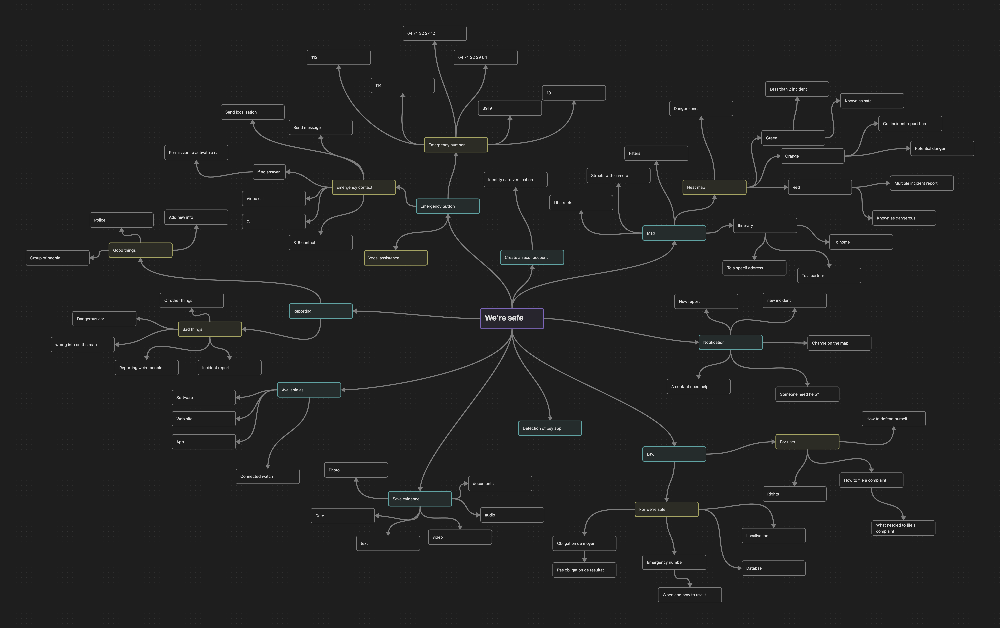

## Creation of an account

### User registration

The user must register for an account by providing basic information such as:
- their name, 
- email address,
- a password. 

The app should verify that the email address is valid and unique to prevent duplicate accounts.

### Account setup 

Once the user has registered, they need to complete their account setup by providing additional information such as:
- their phone number, 
- address, 
- emergency contacts. 

They may also need to answer some security questions to help verify their identity in case of a forgotten password or other issues.

### Personalized settings

The app should allow users to customize their settings based on their individual preferences and needs. This might include choosing a language, setting a home location or preferred route for daily travel, and configuring notification settings.

### Emergency contacts

The app should allow users to add emergency contacts, such as family members or friends, who can be notified in case of an emergency. Users may also be able to choose different contacts for different types of emergencies (e.g. medical emergencies, personal safety threats).

### Privacy and security

The app should ensure the user's privacy and security by providing features such as two-factor authentication, secure data encryption, and clear privacy policies. Users should also have the option to delete their account and all associated data if they choose to do so.

### User support

The app should provide user support through various channels such as a help centre, in-app chat, or email. The app should also provide clear instructions on how to use its features, troubleshoot common issues, and contact support if needed.

## Emergency button 

### Quick access

The emergency button should be easily accessible to the user, even in stressful or dangerous situations. This might mean placing it on the home screen of a mobile app or website or making it a physical button on a device.

An emergency button could be placed in the control centre on phones.

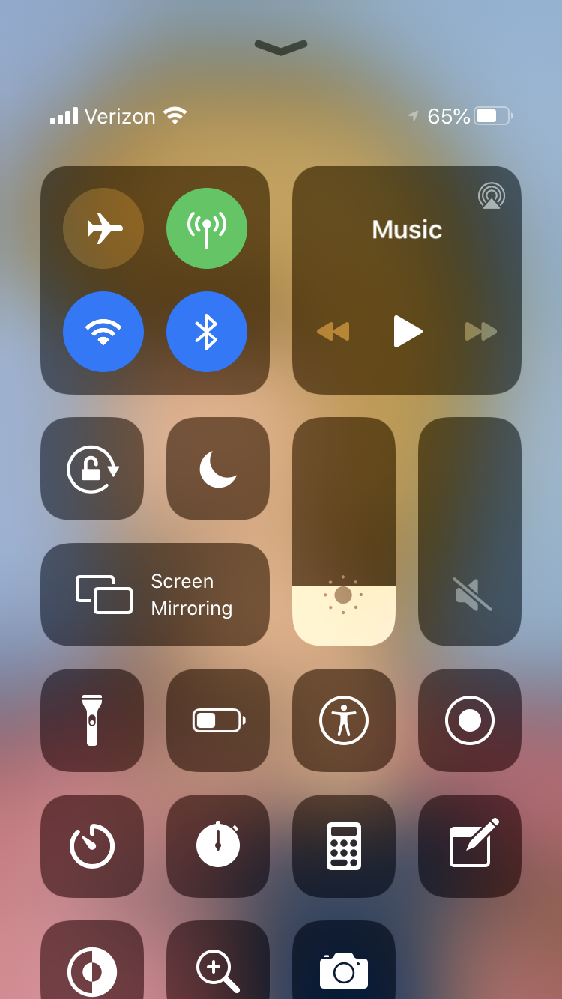

### One-touch activation

The emergency button should be easy to activate with one touch or click, to minimize the time it takes to call for help.

### Emergency contact

The user should be able to set up their emergency contacts in advance so that when the button is activated, the system will automatically notify those contacts.
The user could choose a contact following the emergency. 

- Need help at her apartment -> her neighbour

- Need help at her job -> her colleague

It could avoid sending a message to someone that can't help.

### Location tracking

When the emergency button is activated, the system should be able to track the user's location in real-time, so the contacts can quickly locate and assist them.

The user should allow the app to take and share the location before they need help. The users won't lose time at the wrong moment.

### Audio or video recording

Some emergency button systems include audio or video recording capabilities, which can provide valuable evidence in an emergency situation.

### Alerts and notifications: 

Once the emergency button is activated, the system should provide alerts and notifications to the user and their emergency contacts, to ensure that help is on the way.

### Emergency numbers

- **112**: Emergency number for the European Union, which can be dialled from any member state to reach emergency services such as police, fire, and medical services.

- **18**: Emergency number in France for the fire department (Fire brigade).

- **3919**: National helpline in France for women who are victims of violence. It provides information, support, and referral to local resources.

- **114**: Emergency number in France for people who are deaf, hard of hearing, or speech-impaired. It allows people to contact emergency services through SMS or fax.
- **04 74 22 39 64**: Information on women's rights, family mediation and employment in France.

### Vocal assistance

## Map

- **Current location**: The map displays the user's current location as a blue dot on the map. This can help users to orient themselves and understand their surroundings.

- **Street view**: Users can use the street view feature to see what the area around them looks like. This can be especially helpful for those who are in an unfamiliar area and want to get a better sense of their surroundings.

### Heat map

The heat map[^heatmap] will be used to display the density of crime incidents in a particular area. By analyzing this data, users can make more informed decisions about where to go and what precautions to take. 

For example, a user who is travelling to an unfamiliar city could consult the heat map to identify areas with high crime rates and plan a route that avoids those areas. Similarly, a user who is planning to go for a run or walk could use the heat map to find routes that are safer and have a lower incidence of crime.

- **Green**: Green areas will be where less than two incidents have occurred. These will be known safe areas.

- **Orange**: Orange areas will be where more than two incidents have occurred. These will be places with potential danger.

- **Red**: Red areas will be those where more than five incidents have taken place in less than a month or where there are recurrent assaults. These are dangerous areas.

### Map Filters

To help users to find streets to feel safer we can propose to see particular information like:

- **Street lighting**: The map will indicate the level of street lighting in a particular area. This can help users to avoid areas that are poorly lit and potentially dangerous.

- **Streets with cameras**: The map also shows the street level with cameras in a particular area. Cameras are known to deter aggressors.

- **Safe places**: The map can also show safe locations near the user, such as police stations, hospitals and fire stations. This can help users quickly locate a safe place if they feel threatened or in danger. We can also add safe place partners, and public places such as bars or bakeries, which are open late at night and early in the morning. These partner places will be willing to take people in and keep them safe from harm.

- **Heat map**: The users can choose to see the heat map or not.

### Safe itinerary

The map includes a navigation feature that can help users to get directions to a particular location. This can be helpful for those who are unfamiliar with an area and need help finding their way. It could propose a safe route through lit streets and streets with cameras.

## Reporting

The reporting feature can be used by users to report incidents of harassment, abuse, assault, or any other safety concern to the relevant authorities or support services. This feature allows users to document and report incidents quickly and easily, providing valuable information for law enforcement or other agencies to investigate and potentially prevent future incidents.

- **Good things**: Users should be able to report a police patrol or a group of people. They can also report new information on the map.

- **Bad things**: Users should be able to report a group of people, an incident, a dangerous car or even wrong information on the map.

## Notification

### Receive notification

Here is the different type of notifications the user can receive:

- New incident,

- New report,

- A contact need help,

- Change on the map.

### Send notification

When the user needs help or feels unsafe, they can send a notification to their emergency contacts. 

## Detection of spy application

A spy app detection feature can be used for several reasons:

- **Privacy protection**: Spy apps can be installed on a device without the user's knowledge, and they can monitor and record the user's activities, including their calls, text messages, social media messages, browsing history, and more. A spy app detection feature can help users identify if such an app is installed on their device, allowing them to remove it and protect their privacy.

- **Security**: Spy apps can be used by hackers and cybercriminals to gain unauthorized access to a user's device and steal sensitive information. By detecting and removing such apps, a spy app detection feature can help prevent security breaches and protect users from identity theft and other cybercrimes.

- **Legal compliance**: In many jurisdictions, the use of spy apps is illegal without the consent of the person being monitored. A spy app detection feature can help users ensure that they are not inadvertently violating the law by unknowingly installing a spy app on someone else's device.

The feature must be easy to use and simple to understand. 
The user must allow access to the device then the software will be able to detect if there is a spy app or not.

If there is a spy app on the user's device, the user should receive information on the type of software and how to remove it.

## Database of evidence

A database of evidence can be a useful tool in this project for several reasons. It can help to centralize and organize all the evidence related to a particular case, such as photos, videos, audio recordings, and text messages. This can make it easier for individuals to access and manage the evidence, and can also make it easier to present the evidence in court or to law enforcement if needed.

In addition, having a database of evidence can help to protect the evidence from being lost or destroyed. It can provide a backup in case the original evidence is lost or damaged, and can also help to prevent tampering with the evidence.

Another important benefit of a database of evidence is that it can help to protect the privacy and security of the individuals involved in the case. The evidence can be stored securely and only accessible to authorized individuals, which can help to prevent unauthorized access or leaks of sensitive information.

The database of evidence should capable to store:
- Pictures,
- Documents,
- Video,
- Audio,
- Text.

## Out of service

The entire application should be usable without an internet connection. 
Most of the features should be usable without a network connection.

## Cross-platform

- **Compatibility with multiple platforms**: The software must be designed to run on different operating systems[^os], such as Windows, macOS, Linux, iOS, and Android.

- **Native app features**: The software should take advantage of native features of each platform, such as GPS, camera, or push notifications, to provide a better user experience.

- **Cloud integration**: The software could integrate with cloud services, such as Dropbox or Google Drive, to allow users to synchronise data across multiple devices.

- **Easy updates**: Make things easy to maintain and fix issues in the app.

## Law information

As a software project, various legal considerations need to be considered. Here is some general legal information that needs to be considered for the project:

- **Privacy laws**: The software is going to collect and store user data, so it's important to comply with relevant privacy laws, such as GDPR[^gdpr] in the European Union or CCPA[^ccpa] in California.

- **Intellectual property laws**: Make sure that the images and other content used in your app do not violate any copyright or trademark laws.

- **Security laws**: As we are going to store personal or sensitive data, we may need to comply with security laws, such as the Cybersecurity Information Sharing Act (CISA)[^cisa] in the US.

- **Consumer protection laws**: The software must be transparent about the features it provides and any limitations or risks associated with using it.

- **Accessibility laws**: The software should comply with accessibility laws, such as the Americans with Disabilities Act (ADA)[^ada] in the US or Référentiel Général d’Accessibilité pour les Administrations (RGAA)[^rgaa] in France, to ensure that people with disabilities can use it.

<!-- 
#### Obligation of means

#### Emergency numbers

#### Location

#### Database
 -->

# Acceptance criteria

- The emergency button should be prominently displayed on the home screen, with no more than one tap required to activate it.

- The emergency button feature must be easily accessible from all areas of the app, and must immediately notify emergency services when activated.

- The software should be able to accurately detect spyware on the user's device with at least 95% accuracy.

- The map should accurately display the user's location and provide directions to safe places nearby within 1 meter of the user's current location.

- The reporting feature should allow the user to submit a report with all necessary information, including the type of incident, location, and any supporting evidence such as photos or videos, within 2 minutes.

- The database of evidence should be able to securely store and retrieve evidence for at least 5 years, and allow authorized personnel to search and filter the evidence by location, type of incident, and other relevant criteria.

- The database of evidence must be secure, with appropriate measures in place to protect the privacy and safety of those reporting incidents.

- The database of evidence must have robust backup and disaster recovery procedures in place to ensure that data is not lost in the event of a system failure or natural disaster.

- The heat map feature must accurately represent areas of high and low safety based on the reported incidents and user feedback.

- The map filters must allow users to quickly find the information they are looking for, and must accurately reflect the reported incidents and user feedback.

- The reporting feature must be easy to use and provide clear instructions for how to report an incident, including what types of incidents should be reported and what information is required.

- The software must comply with all relevant laws and regulations related to privacy, data protection, and reporting incidents of violence or abuse.

- The software must be available in multiple languages to support a diverse user base.

- The software must be compatible with multiple devices and operating systems to ensure broad accessibility.

- The software must be user-friendly and intuitive, with clear navigation and helpful feedback.

- The software must be regularly updated and maintained to address bugs and security issues and to incorporate user feedback.

- The software must be designed with scalability in mind and must be able to handle a large volume of users and incidents without experiencing performance issues or downtime.

- The software must be tested thoroughly before launch to ensure that it is reliable and free of bugs or glitches.

- The software must be designed with accessibility in mind including features for users with visual, hearing, or motor impairments.

- The reporting feature must allow users to edit or delete a report if they made a mistake or if the information changes.

- The heat map feature must update in real-time as new incidents are reported, and must be refreshed every 24 hours to ensure accurate representation.

# Design

# Non-functional requirements

- **Performance**: The software should respond quickly and provide a smooth user experience, even when there are many users or large amounts of data.

- **Reliability**: The software should be available and responsive at all times, and should not lose any data or fail unexpectedly.

- **Security**: The software should protect user privacy and confidential data, and should be resistant to attacks and unauthorized access.

- **Usability**: The software should be easy to learn and use, even for users with limited technical experience, and should provide helpful feedback and clear error messages.

- **Scalability**: The software should be able to handle increasing numbers of users and data without a significant decrease in performance or reliability.

- **Maintainability**: The software should be easy to update and modify as necessary, with well-organized code and clear documentation.

- **Compatibility**: The software should be compatible with a wide range of devices, browsers, and operating systems.

- **Accessibility**: The software should be designed to support users with disabilities or special needs, with appropriate accommodations and accessible features.

# Out of scope

- The development of physical safety devices, such as pepper spray or personal alarms, is not part of this project. While these devices may provide an additional layer of personal safety, the project is developing a software application to help users report incidents or abuse and access resources for support.

- Legal representation or support beyond the scope of reporting incidents is not part of the project. While it is important to ensure that victims of violence or abuse have access to legal services, this project is focused on developing a software application to facilitate the reporting of incidents and provide resources for support.

- Implementing features or functions not related to the core objectives of the project, such as a social network or e-commerce capabilities, is not part of the project. The project has a specific set of core objectives, and any features or functions not directly related to those objectives are considered out of scope.

- Providing medical or psychological services beyond the scope of reporting incidents and providing resources for support is out of the scope of this project. While it is important to provide victims of violence or abuse with access to medical and psychological services, this project is focused on developing a software application to facilitate the reporting of incidents and provide resources for support.

- The development of additional hardware, such as wearable devices or sensors, beyond what is necessary to support the features of the app, is out of the scope of this project. The project is focused on developing a software application to help users report incidents of violence or abuse and access resources for support, and any additional hardware development is considered out of scope.

- Providing security or protection beyond the scope of reporting incidents, such as monitoring or tracking individuals who may pose a threat, is out of the scope of this project. The focus of the project is on developing a software application to help users report incidents of violence or abuse and access resources for support, and any additional security or protection services are considered out of scope.

# Constraints and assumptions

## Constraints

- **Budget**: There is no money available for this project. So I may need to make trade-offs for features and functionality I can deliver.

- **Timeline**: Being limited by a fixed deadline may impact my ability to deliver some features or functionality.

- **Regulatory requirements**: I may be blocked by legal or regulatory requirements that will dictate certain aspects of the design or implementation of the software.

- **Technical limitations**: I can be blocked by the available technology or my technical expertise.

## Assumptions

- **User behaviour**: I may assume that users will use the software as intended, and will report incidents accurately and truthfully.

- **Device compatibility**: I may assume that the software will work on a wide range of devices and operating systems, despite the challenges associated with developing cross-platform software.

- **Data accuracy**: I may assume that the data collected and reported by users is accurate and reliable.

- **Language**: I may assume that the software will be used primarily by users fluent in the language(s) available.

- **User adoption**: I may assume that the software will be used by users and will have a positive impact on the incidence of violence and abuse.

# Security

- **Authentication and Authorisation**: To ensure that only authorised users can access the data and perform specific actions, the application should have a robust authentication and authorization mechanism. This could include multi-factor authentication, password policies, and role-based access control.

- **Encryption**: Encryption[^encryption] can be used to protect data both at rest and in transit. Data at rest should be encrypted on the server and any backups or archives, and data in transit should be encrypted using SSL[^ssl]/TLS[^tsl].

- **Data Backup and Disaster Recovery**: Regular backups of the data should be taken to ensure that in the event of a disaster or data loss, the data can be restored. The backups should be encrypted and stored in a secure location that is separate from the production environment.

- **Logging and Monitoring**: The application should have robust logging and monitoring capabilities to detect and respond to any suspicious or malicious activities. This can include logging all user actions and system events, and monitoring system resources and network traffic.

- **Vulnerability Scanning and Penetration Testing**: Regular vulnerability scanning and penetration testing can be performed to identify and remediate any security vulnerabilities in the application.

- **Regular Security Audits**: Regular security audits can be performed by an independent third party to ensure that the application is compliant with all relevant security standards and best practices.

# Footnotes

[^algosup]: ALGOSUP is a computer science school based in Vierzon. And also a stakeholder in this project.

[^spy]: A spy app, also known as spyware or stalker ware, is software that can be installed on a device, such as a smartphone or a computer, without the owner's knowledge or consent. Once installed, a spy app can track the device's location, monitor the owner's calls, messages, and online activity, and even record their keystrokes and take screenshots.

[^device]: smartphone, computer, tablet...

[^cross]: In the context of technology, cross-platform typically refers to software or applications that are able to run on multiple operating systems or platforms. 

[^heatmap]: A heat map is a feature that displays the density of data points on a map by using a colour gradient.

[^gdpr]: The General Data Protection Regulation is a Regulation in EU law on data protection and privacy in the EU and the European Economic Area.

[^ccpa]: The California Consumer Privacy Act is a state statute intended to enhance privacy rights and consumer protection for residents of California, United States.

[^cisa]: The Cybersecurity and Infrastructure Security Agency works with partners to defend against today's threats and collaborates with the industry to build more secure and resilient infrastructure for the future.

[^ada]: The Americans with Disabilities Act of 1990 or ADA is a civil rights law that prohibits discrimination based on disability.

[^rgaa]: The certification standard for public websites in France, outlines the requirements that websites need to meet to comply with digital laws. 

[^os]: An operating system (OS) is system software that manages computer hardware, and software resources, and provides common services for computer programs.

[^tls]: Transport Layer Security is a cryptographic protocol designed to provide communications security over a computer network.

[^ssl]: Secure Sockets Layer is a standard security technology for establishing an encrypted link between a server and a client.

[^encryption]: Encryption is a way of scrambling data so that only authorized parties can understand the information.