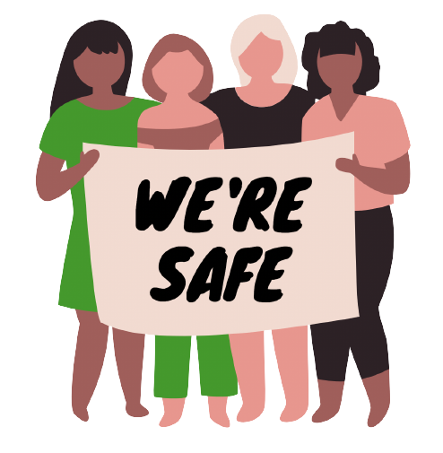

 We're Safe 

Summary of what has been done

 

 Clémentine Curel
  

 

 ALGOSUP,  We're safe. All Rights Reserved. 

 

<detail>

- [What has been done?](#what-has-been-done)
- [What is going on?](#what-is-going-on)
- [What's next?](#whats-next)

</detail>

From the start of the project, I spend a lot of time defining the project features and increasing my knowledge of the subject.

## What has been done?

- Finding a name,
- Creating a logo
- Product requirements document
- First draft of planning for documents
- Mind map of the project
- Survey with 200 answers
- Mockup and design
- Search on statistiques 
- Search on competition
- Product research
- User research
- Curation of the subject

## What is going on?

- Find a new logo
- Mockup and design
- Functional specifications
- KPIs

## What's next?

- Finalise the documents
- Technical
- Planning
- Survey analysis
- Technical 
- Test plan
- Retro planning
- Github's readme
- Database of bug template
- Mini functional for each feature
- Story map
- Software architecture design choices
- Start the developing of the project
- Start the test phase